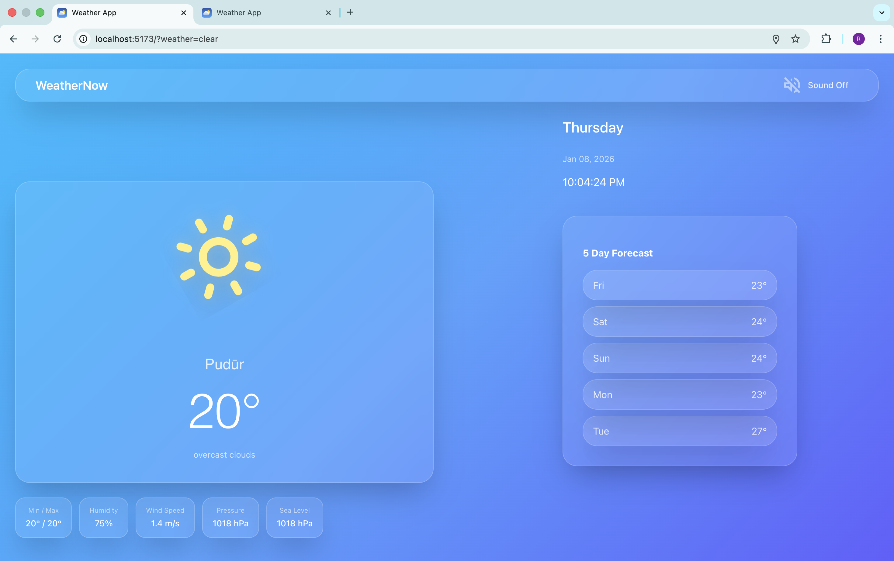
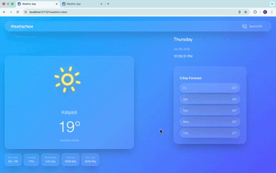
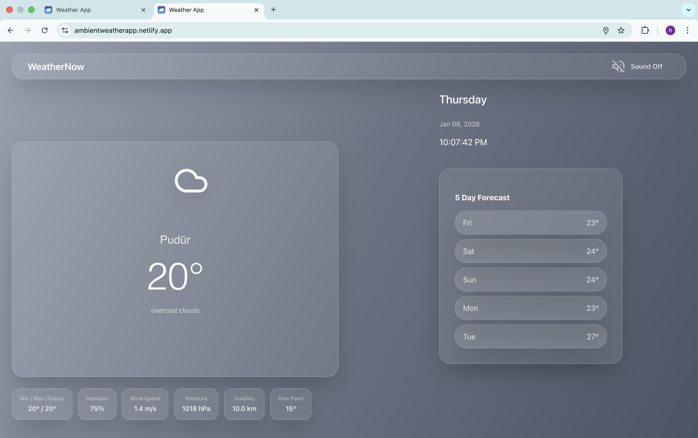
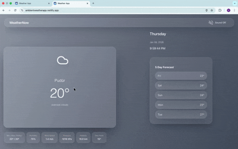
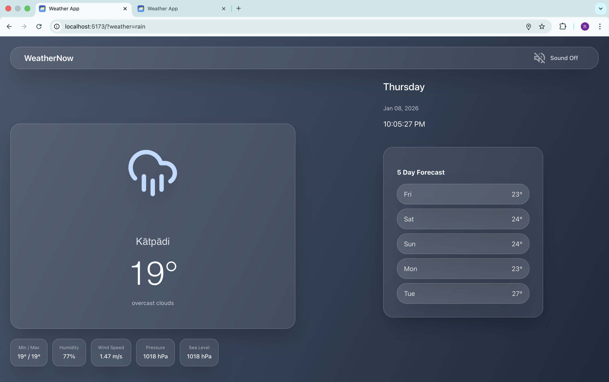
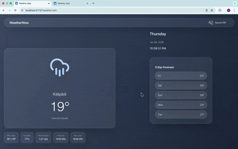
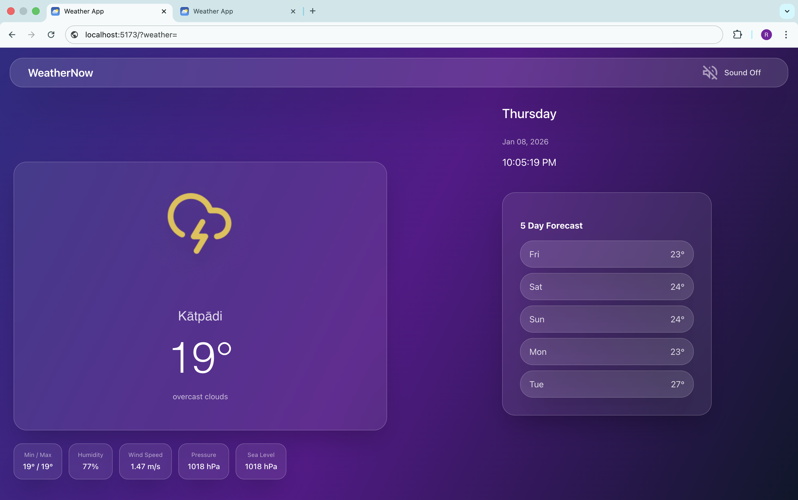
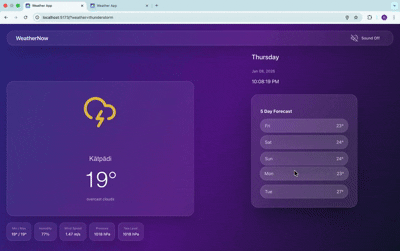

#  WeatherNow — Ambient Weather Experience

[](https://reactjs.org/)
[](https://vitejs.dev/)
[](LICENSE)
[](https://openweathermap.org/)

A modern, minimal, and immersive weather application built with **React + Vite**, featuring glassmorphism UI, animated weather icons, dynamic themes, real-time data, and ambient weather sounds — inspired by Apple Weather & Material Design.

<div align="center">
[🚀 Live Demo](https://ambientweatherapp.netlify.app/) 
</div>


##  Features

-  **Automatic Location Detection** — Uses Geolocation API to fetch weather for your current location
-  **Dynamic Weather-Based Themes** — UI adapts colors and gradients based on weather conditions
-  **Glassmorphism UI** — Beautiful frosted glass cards with backdrop blur effects
-  **Animated Weather Icons** — Smooth SVG animations powered by Lucide React
-  **Ambient Weather Sounds** — Immersive audio experience with toggle control (Web Audio API)
-  **Real-Time Data** — Current temperature, feels like, humidity, wind speed, pressure, and more
-  **Daily Min/Max Temperature** — Accurate temperature range display
-  **Visibility** — Comprehensive weather metrics
-  **Fast & Lightweight** — Vite-powered for instant hot module replacement (HMR)
-  **Responsive Design** — Works seamlessly on desktop, tablet, and mobile

---

##  UI Preview (Design Showcase)

###  Clear Sky
*Soft sky blue gradients with golden sun animation and gentle pulsing effect*



<details>
<summary>🎞️ View Animated GIF</summary>



</details>

---

### ☁️ Cloudy
*Muted grey tones with drifting cloud motion and subtle animations*



<details>
<summary>🎞️ View Animated GIF</summary>



</details>

---

### 🌧️ Rainy
*Cool dark palette with rain motion, bounce animation & ambient rain sound*



<details>
<summary>🎞️ View Animated GIF</summary>



</details>

---

### ⛈️ Thunderstorm
*Deep purple tones with lightning flash effect and thunder ambience*



<details>
<summary>🎞️ View Animated GIF</summary>



</details>

---

##  Tech Stack

| Layer | Technology |
|-------|------------|
| **Frontend** | React 18 + Vite |
| **Styling** | CSS3 (Glassmorphism, Animations, Gradients) |
| **Weather API** | [OpenWeatherMap API](https://openweathermap.org/api) |
| **Audio** | Web Audio API (Synthesized Sounds) |
| **Icons** | [Lucide React](https://lucide.dev/) |
| **State Management** | React Hooks (useState, useEffect, useRef) |
| **Build Tool** | Vite 5 |
| **Geolocation** | Browser Geolocation API |

---

## 📂 Project Structure

```
weather-app-vite/
├── public/
│   └── vite.svg
│
├── src/
│   ├── components/
│   │   ├── WeatherCard.jsx      # Main weather display card
│   │   └── Loader.jsx            # Loading animation component
│   │
│   ├── hooks/
│   │   └── useGeolocation.js     # Custom hook for location detection
│   │
│   ├── utils/
│   │   ├── weatherTheme.js       # Theme configuration for weather conditions
│   │   └── useSoundEffect.js     # Web Audio API sound generation
│   │
│   ├── App.jsx                   # Main application component
│   ├── App.css                   # Application-specific styles
│   ├── main.jsx                  # React entry point
│   └── index.css                 # Global styles & CSS reset
│
├── .gitignore                    # Git ignore rules
├── package.json                  # Dependencies & scripts
├── vite.config.js                # Vite configuration
├── README.md                     # Project documentation
└── LICENSE                       # MIT License
```

---

## 🎨 Dynamic Weather Themes

Themes automatically change based on current weather conditions with smooth gradient transitions:

| Weather Condition | Visual Style | Icon Color | Animation |
|-------------------|--------------|------------|-----------|
|  **Clear Sky** | Sky Blue → Powder Blue → Light Cyan | Golden Yellow | Pulse |
|  **Cloudy** | Light Steel Blue → Light Gray → White | Dim Gray | motion |
|  **Rainy** | Slate Gray → Dark Slate → Very Dark | Sky Blue | Bounce |
|  **Thunderstorm** | Blue → Purple → Pink | Golden Yellow | Shake |


---

##  Ambient Weather Sounds

Each weather type has a unique soundscape generated using the **Web Audio API**:

| Weather | Sound Effect | Description |
|---------|-------------|-------------|
|  **Clear** | Bright Chime | Rising sine wave (800Hz → 1200Hz) |
|  **Rain** | Rainfall | White noise with lowpass filter |
|  **Cloudy** | Low Hum | Gentle 200Hz sine wave |
|  **Windy** | Whoosh | Sawtooth wave sweep (100Hz → 400Hz) |

**Sound Toggle:**
- Users can mute/unmute sounds using the volume button in the top-right corner
- Sound plays automatically when weather data loads
- Implemented using Web Audio API (no external audio files needed)

---

## 📊 Weather Data & Metrics

### Current Weather Data
-  **Temperature** — Current, Min, Max, Feels Like
-  **Humidity** — Percentage of moisture in air
-  **Wind Speed** — In meters per second (m/s)
-  **Visibility** — Distance in kilometers
-  **Pressure** — Atmospheric pressure in hPa

### Data Accuracy
- Real-time data from OpenWeatherMap API
- Location-based automatic detection using browser geolocation
- Metric units (Celsius, m/s, km)
- Updates show timestamp for data freshness

---

## ⚙️ Installation & Setup

### Prerequisites

- **Node.js** (v16 or higher)
- **npm** or **yarn**
- **OpenWeatherMap API Key** (Free tier available)

###  Clone the Repository

```bash
git clone https://github.com/Rohithpranov07/WeatherNow.git
cd WeatherNow
```

###  Install Dependencies

```bash
npm install
```

###  Get OpenWeatherMap API Key

1. Go to [OpenWeatherMap](https://openweathermap.org/api)
2. Sign up for a free account
3. Navigate to **API Keys** section
4. Copy your API key

###  Configure API Key

Open `src/App.jsx` and add your API key:

```javascript
// Line ~327 in src/App.jsx
const API_KEY = 'your_openweathermap_api_key_here';
```

**Alternative: Environment Variables (Recommended)**

Create a `.env` file in the root directory:

```env
VITE_OPENWEATHER_API_KEY=your_api_key_here
```

Then update `App.jsx`:

```javascript
const API_KEY = import.meta.env.VITE_OPENWEATHER_API_KEY;
```

###  Run Development Server

```bash
npm run dev
```

The app will be live at:

```
http://localhost:5173
```

###  Build for Production

```bash
npm run build
```

Output will be in the `dist/` directory.

---


### Deploy to Netlify

This project is deployed using Netlify with continuous deployment from GitHub.
[🚀 Live Demo](https://ambientweatherapp.netlify.app/) 


---

##  Testing Weather Themes (Manual Override)

You can test different weather themes by modifying the condition in code temporarily:

```javascript
// In WeatherCard component
const theme = getWeatherTheme('rain'); // Force rain theme
```

Or create a URL parameter system:

```javascript
const urlParams = new URLSearchParams(window.location.search);
const forceWeather = urlParams.get('weather');

// Usage: http://localhost:5173/?weather=rain
```

---

##  Key Features Explained

### 1. Geolocation Hook

Custom React hook for seamless location detection:

```javascript
// src/hooks/useGeolocation.js
const useGeolocation = () => {
  const [location, setLocation] = useState(null);
  const [error, setError] = useState(null);
  const [loading, setLoading] = useState(true);

  useEffect(() => {
    navigator.geolocation.getCurrentPosition(
      (position) => setLocation({
        lat: position.coords.latitude,
        lon: position.coords.longitude
      }),
      (err) => setError(err.message)
    );
  }, []);

  return { location, error, loading };
};
```

### 2. Glassmorphism Effect

Achieved using CSS backdrop-filter and transparency:

```css
.card {
  background: rgba(255, 255, 255, 0.1);
  backdrop-filter: blur(20px);
  border: 1px solid rgba(255, 255, 255, 0.2);
  border-radius: 24px;
}
```


## 🔧 Configuration

### Vite Configuration

```javascript
// vite.config.js
import { defineConfig } from 'vite'
import react from '@vitejs/plugin-react'

export default defineConfig({
  plugins: [react()],
})
```

### Package.json Scripts

```json
{
  "scripts": {
    "dev": "vite",
    "build": "vite build",
    "preview": "vite preview"
  }
}
```

---

##  Troubleshooting

### Issue: Location Access Denied

**Solution:** Enable location permissions in browser settings.

```
Chrome: Settings → Privacy and security → Site Settings → Location
Firefox: Preferences → Privacy & Security → Permissions → Location
```

### Issue: API Key Not Working

**Solution:** 
1. Verify API key is correct
2. Check if API key is activated (takes 10-15 minutes)
3. Ensure you're using the correct endpoint

### Issue: Sounds Not Playing

**Solution:**
1. Check browser audio permissions
2. Unmute the app using the volume button
3. Some browsers require user interaction before playing audio

---

##  Future Enhancements

- [ ]  **Hourly Temperature Graph** — Interactive 24-hour forecast chart
- [ ]  **City Search** — Manual location search with autocomplete
- [ ]  **Day/Night Themes** — Automatic dark mode based on sunset/sunrise times
- [ ]  **Wind Direction** — Visual compass showing wind direction
- [ ]  **PWA Support** — Install as standalone mobile app
- [ ]  **Weather Map** — Interactive map showing weather patterns
- [ ]  **Weather Alerts** — Push notifications for severe weather
- [ ]  **Multi-Language** — i18n support for multiple languages
- [ ]  **Historical Data** — Past weather trends and statistics
- [ ]  **Custom Themes** — User-selectable color schemes

---

## 👨‍💻 Author

**V. Rohith Pranov**  
B.Tech Computer Science Engineering  
UI/UX + Frontend Developer

[](https://github.com/Rohithpranov07)
[](https://linkedin.com/in/rohithpranov)
[](mailto:rohithpranov.v2024@vitstudent.ac.in)

---

##  Acknowledgments

- **[OpenWeatherMap](https://openweathermap.org/)** — Weather data API
- **[Lucide Icons](https://lucide.dev/)** — Beautiful open-source icons
- **[Vite](https://vitejs.dev/)** — Lightning-fast build tool
- **[React](https://reactjs.org/)** — Component-based UI library
- **Inspiration** — Apple Weather, Material Design, Figma, Chatgpt, Claude.

---


## 📚 API Reference

### OpenWeatherMap Endpoints Used

#### Current Weather Data
```
GET https://api.openweathermap.org/data/2.5/weather
```

**Parameters:**
- `lat` — Latitude
- `lon` — Longitude  
- `units` — metric (Celsius)
- `appid` — Your API key

**Response Example:**
```json
{
  "name": "Katpadi",
  "main": {
    "temp": 28,
    "feels_like": 30,
    "temp_min": 28,
    "temp_max": 28,
    "pressure": 1016,
    "humidity": 41,
    "sea_level": 1016
  },
  "weather": [{
    "main": "Clear",
    "description": "clear sky"
  }],
  "wind": {
    "speed": 6.29
  },
  "visibility": 10000,
  "sys": {
    "country": "IN"
  }
}
```

---

## 🎓 Learning Resources

If you're new to any of the technologies used:

- **React:** [Official React Docs](https://react.dev/)
- **Vite:** [Vite Guide](https://vitejs.dev/guide/)
- **CSS Glassmorphism:** [Glassmorphism Generator](https://hype4.academy/tools/glassmorphism-generator)
- **Geolocation API:** [MDN Geolocation](https://developer.mozilla.org/en-US/docs/Web/API/Geolocation_API)
- **Claude**
- **ChatGpt**
- **Figma** [Figma File](https://www.figma.com/design/COwKPUypamZds7wStdNDkE/ACM-WeatherApp?node-id=0-1&m=dev&t=BNpUbPh0mBY3Sf0W-1)

---


